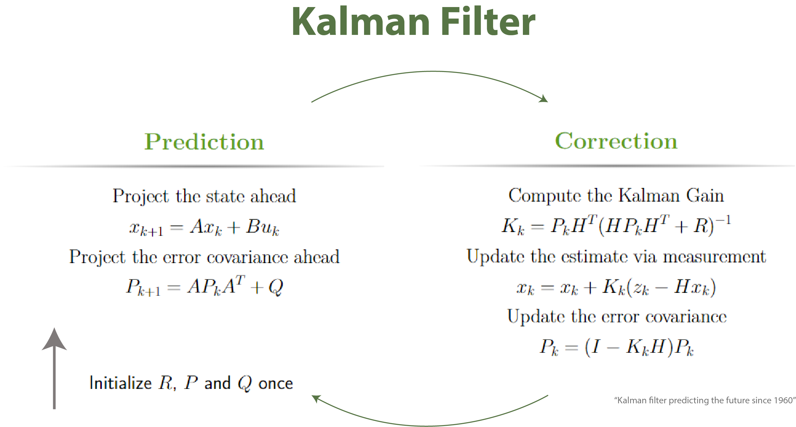

# Robotics Algorithms in Python

Implementation of various robotics sample algorithms for autonomous systems in Python.

# Requirements

- Python 3.6.x

- numpy

- pandas

- matplotlib

- scipy

# Installation

1. Install the required libraries.

2. Clone this repo.

3. Execute python script in each directory.

# Localization

## Kalman Filter localization

Estimating the current state of a system given new observations and controls. 

Ref:- [PROBABILISTIC ROBOTICS](http://www.probabilistic-robotics.org/)

## Extended Kalman Filter localization

Ref:- [PROBABILISTIC ROBOTICS](http://www.probabilistic-robotics.org/)
 
## License 

MIT

